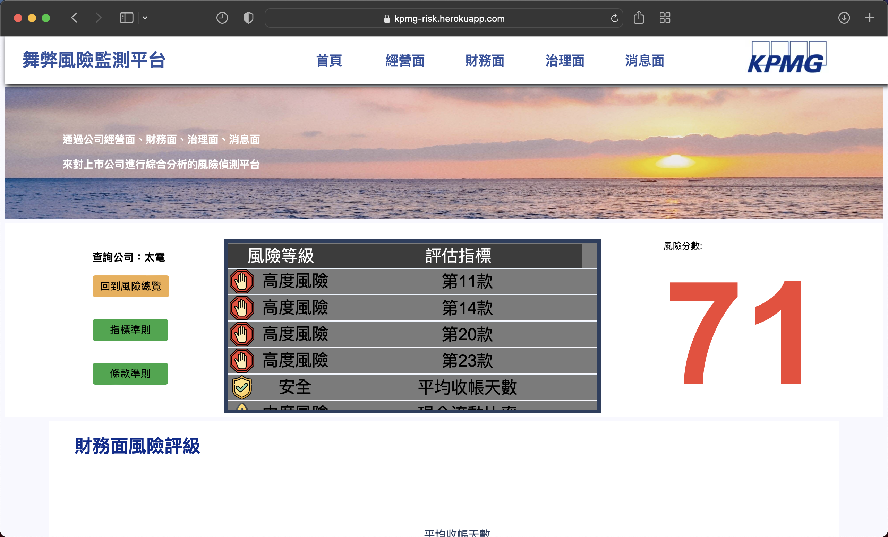
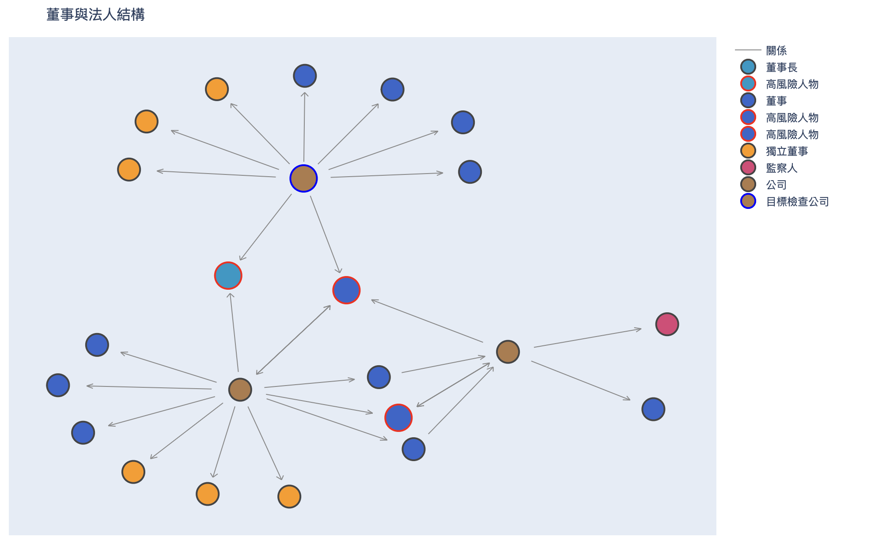

# Fraud Detection of company

## Introduction
The visual graph of fraud detection website, determine whether the company is at risk of fraud in 4 different aspect, using news, node centrality, M-score, etc. to calculate the risk score

## Demonstration
- [demo](http://kpmg-risk.herokuapp.com/)

## Data

- The overall data proceessing is in [KPMG data analysis.py](https://github.com/h30306/Fintech.github.io/blob/master/KPMG%20data%20analysis.py)
- The usage data is under the [data folder](https://github.com/h30306/Fintech.github.io/tree/master/data)
